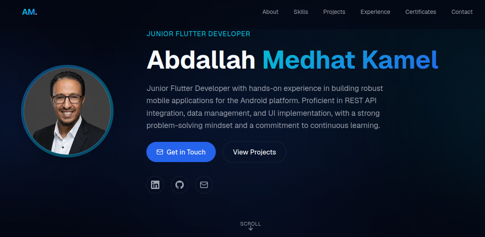

<div align="center">

# Abdallah Medhat Kamel

### Junior Flutter Developer • Mobile Application Developer

<p>
  <a href="https://abdallahmedhat.dev">
    
  </a>
  <a href="https://vercel.com">
    
  </a>
</p>

<p>
  
  
  
  
</p>

<p>
  <a href="https://abdallahmedhat.dev">Website</a> •
  <a href="https://github.com/Abdalla-Medhat/My-Website-">Repository</a> •
  <a href="https://linkedin.com/in/abdallah-medhat1/">LinkedIn</a> •
  <a href="mailto:abdallahmedhat.dev@gmail.com">Email</a>
</p>

</div>

---

# Preview

> 📸 **Screenshot from the website**

<p align="center">
  
</p>

---

# Overview

This repository contains the source code for my personal portfolio website.

Built with **Next.js 16**, **TypeScript**, **Tailwind CSS v4**, and **Framer Motion**, the website showcases my experience as a **Mobile Application Developer**, including projects, technical skills, certifications, education, and professional information through a modern, responsive user experience.

---

# Live Website

🌐 **https://abdallahmedhat.dev**

---

# Repository

📦 **https://github.com/Abdalla-Medhat/My-Website-**

---

# AI-Assisted Development

This portfolio was created using an AI-assisted development workflow.

### Workflow

- Prompt engineering with ChatGPT
- Code generation using OpenCode
- DeepSeek V4 Flash
- Manual review and refinement
- Final optimization
- Deployment on Vercel

The complete prompt used during development can be found in:

```text
docs/portfolio-prompt.md
```

---

# Tech Stack

| Category | Technology |
| ---------- | ---------- |
| Framework | Next.js 16 (App Router) |
| Language | TypeScript |
| Styling | Tailwind CSS v4 |
| Animation | Framer Motion |
| Icons | Lucide React |
| Fonts | Geist |
| Deployment | Vercel |

---

# Features

- Responsive design across all devices
- Premium dark interface
- Hybrid UI with subtle Glassmorphism
- Smooth page transitions and animations
- Aurora and mesh gradient backgrounds
- SEO optimized
- Accessible semantic HTML
- Contact section
- Dynamic portfolio data
- Component-based architecture

---

# Website Sections

| Section | Description |
| -------- | ----------- |
| Hero | Introduction, profile image and call-to-action buttons |
| About | Biography and personal information |
| Skills | Technical skills grouped by category |
| Technology Stack | Languages, frameworks and development tools |
| Featured Projects | Highlighted work |
| Other Projects | Additional projects |
| Experience | Professional experience |
| Education | Academic background |
| Certificates | Professional certifications |
| Contact | Contact information and social links |
| Footer | Footer and quick navigation |

---

# Getting Started

Clone the repository

```bash
git clone https://github.com/Abdalla-Medhat/My-Website-.git
```

Install dependencies

```bash
npm install
```

Run the development server

```bash
npm run dev
```

Create a production build

```bash
npm run build
```

Start the production server

```bash
npm run start
```

Open:

```
http://localhost:3000
```

---

# Project Structure

```text
My-Website-/
├── public/
│   └── images/
├── src/
│   ├── app/
│   ├── components/
│   └── data/
├── docs/
│   ├── images/
│   │   └── portfolio-preview.png
│   └── portfolio-prompt.md
├── .gitignore
├── next.config.ts
├── package.json
├── tsconfig.json
├── eslint.config.mjs
└── postcss.config.mjs
```

---

# Design System

The website follows a hybrid visual language.

- **70%** Modern Dark UI
- **20%** Soft Glassmorphism
- **10%** Premium Glow Effects

### Color Palette

| Role | Color |
|------|-------|
| Primary Background | `#030712` |
| Secondary Background | `#0B1220` |
| Surface | `#111827` |
| Primary Accent | `#2563EB` |
| Secondary Accent | `#06B6D4` |
| Success | `#22C55E` |
| Warning | `#F59E0B` |
| Text Primary | `#F8FAFC` |
| Text Secondary | `#9CA3AF` |

---

# Deployment

The project is deployed on **Vercel**.

Every push to the production branch automatically triggers a new deployment.


<div align="center">

## 🌐 Live Website

### https://abdallahmedhat.dev

Built with ❤️ using **Next.js**, **TypeScript**, **Tailwind CSS**, **Framer Motion**, and deployed on **Vercel**.

</div>
